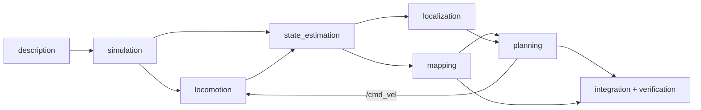
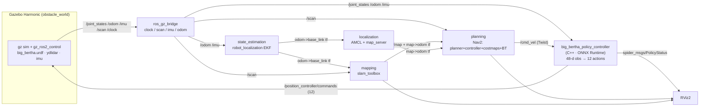
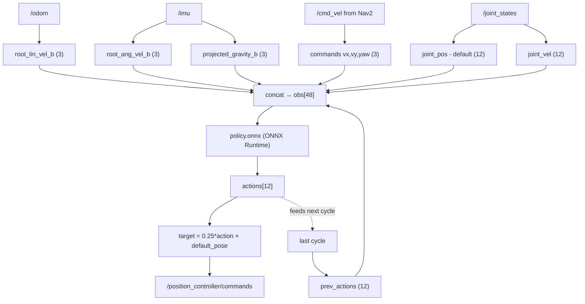
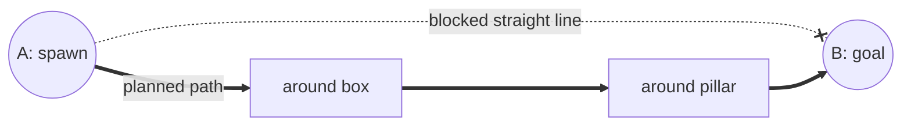
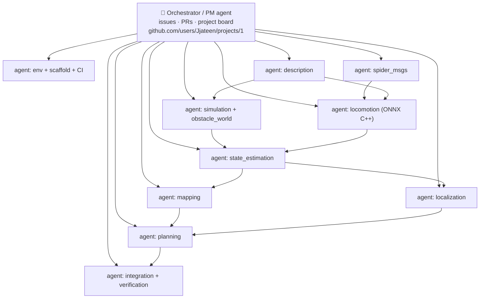
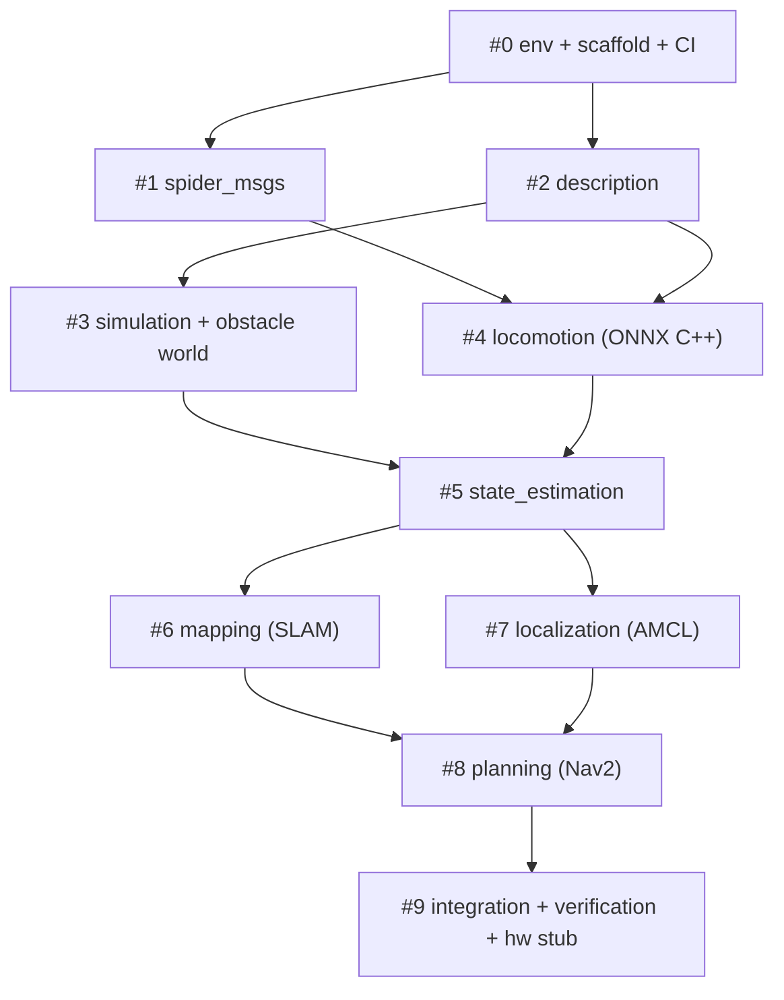

# Spider Bot Bringup — Execution Plan

> Bring up the trained **Big Bertha** quadruped (PPO locomotion policy) in ROS 2:
> run the learned gait, estimate state, build a map with SLAM, localize, and plan
> point-A-to-point-B paths that avoid obstacles — all demonstrated in a Gazebo world
> with a dummy map full of obstacles.
> Sim bringup first; hardware bringup scaffolded but empty.
>
> Everything is built **for Big Bertha** for now (URDF, meshes, weights all come from Big Bertha).

---

## 1. Locked decisions

| Decision | Choice | Why |
|---|---|---|
| Simulator | **Gazebo Harmonic** = `gz-sim 8` (`gz sim`, `gz_ros2_control`, `ros_gz`) — **the** tier-1 Jazzy pairing; **not** Gazebo Classic (EOL) | Native Nav2/SLAM/lidar ecosystem; `ros-jazzy-ros-gz` binaries are built against Harmonic; Big Bertha URDF already ships a `.gazebo` plugin file + ydlidar |
| Robot model | **Big Bertha URDF**, copied from `spider_bot_training/assets/URDF/big_bertha/` | Everything is built for Big Bertha for now |
| Policy runtime | **ONNX Runtime (C++)** loading `policy.onnx` | Lightweight, no Python/LibTorch in the loop; satisfies "all nodes in C++" |
| ROS distro | **Jazzy** | Forced by host (Ubuntu 24.04) **and** by the deploy target (Arduino UNO Q, arm64) |
| Node language | **All runtime nodes C++** | Launch files stay Python/XML, verification stays shell/CLI — neither is a runtime node |
| Custom interfaces | **Yes — `spider_msgs` package** (robot-agnostic, **not** `big_bertha_*`) | Health introspection + safe arm/disarm + hot-swap policy; kept generic so the future **Lil Spider** shares the same interfaces in this repo |
| Best weights | `bigt_bertha_exported/exported/policy.onnx` | Exported Big Bertha PPO policy |
| Execution | **Multi-agent** (1 orchestrator + per-module workers) | Parallelize the autonomy stack; agents self-verify before handoff |

**Host detected:** Ubuntu 24.04.4 LTS, no `/opt/ros`, no Gazebo, no ONNX Runtime installed yet → a Phase 0 environment-setup step is required.

---

## 2. The trained policy contract

Derived from `spider_bot_training/source/big_bertha/.../big_bertha_env_cfg.py` and `big_bertha_env.py`.

### Observation — 48 floats, concatenated in this exact order

| slice | size | source on sim/real robot |
|---|---|---|
| `root_lin_vel_b` | 3 | odometry, body frame |
| `root_ang_vel_b` | 3 | IMU angular velocity |
| `projected_gravity_b` | 3 | IMU orientation |
| `commands` (vx, vy, yaw_rate) | 3 | **`/cmd_vel` from Nav2** |
| `joint_pos − default` | 12 | `/joint_states` |
| `joint_vel` | 12 | `/joint_states` |
| `prev_actions` | 12 | node's own last output |

### Action — 12 floats

```
joint_target = action_scale * action + default_joint_pos
action_scale = 0.25
```

- Joints: `Revolute_110 … Revolute_121` (4 legs × 3 joints).
- Default pose per leg: `[0.0, 0.5, 0.0]`.

> The legacy `spider_ros_node/policy_publisher.py` uses a **30-dim** observation (older spider policy, no odometry/joint-velocity). Big Bertha's exported policy is **48-dim** and **requires** odometry + joint velocities. The new C++ node builds the full observation.

---

## 3. Autonomy decomposition (functional modules)

The stack is decomposed into functional modules, in data-flow order. Each module is an independently buildable + verifiable unit, and each maps to a worker agent (see §8).

```
description          robot model: Big Bertha URDF/xacro, meshes, ros2_control, sensor frames
simulation           Gazebo world (dummy map + obstacles), spawn, ros_gz_bridge, sensors
locomotion           C++ ONNX policy controller: /cmd_vel → learned gait → 12 joint targets
state_estimation     robot_localization EKF: fuse odom + MPU6050 IMU → smoothed odom→base_link
mapping              slam_toolbox: /scan → occupancy grid /map + map→odom tf  (SLAM mode)
localization         AMCL + map_server: localize against a saved map           (known-map mode)
planning             Nav2: global planner + local controller + costmaps + BT → A-to-B, avoids obstacles
integration          full.launch orchestration, RViz, and autonomous self-verification
```

### 3.1 Mermaid — module pipeline



**Two operating modes share the same stack:**
- **SLAM mode** — `mapping` (slam_toolbox) provides `map→odom`; used to explore + build the map.
- **Known-map mode** — `localization` (AMCL + map_server) provides `map→odom` against a pre-saved map; used for repeatable A-to-B navigation demos.

---

## 4. Proposed repo structure (`github.com/Jjateen/spider_bot_bringup`)

5 packages: sim/hardware split (mirrors `mpauv_bringup`), a shared description package, the C++ policy controller, and custom interfaces. Launch + config are organized **by functional module** from §3.

```
spider_bot_bringup/
├── README.md
├── PLAN.md                           # this document
├── .commitlintrc.yml                 # ported from spider_bot_training
├── .pre-commit-config.yaml           # C++/YAML/CMake hooks
├── .github/
│   ├── labeler.yml
│   └── workflows/
│       ├── ros-ci.yml                # colcon build+test · Jazzy · amd64 + arm64
│       ├── compliance.yml            # commitlint + required files + pre-commit
│       └── labeler.yml               # auto-label PRs
│
├── spider_msgs/                      # [ament_cmake] custom interfaces
│   ├── msg/PolicyStatus.msg          # rate, inference_ms, action_norm, enabled
│   ├── msg/GaitCommand.msg           # vx, vy, yaw_rate (the 3-d policy command)
│   ├── srv/SetPolicyEnabled.srv      # safely arm/disarm the gait
│   ├── srv/LoadPolicy.srv            # hot-swap the .onnx model path
│   ├── CMakeLists.txt  ·  package.xml
│
├── big_bertha_description/           # [ament_cmake] Big Bertha robot model
│   ├── urdf/big_bertha.urdf.xacro    # COPIED from assets/URDF/big_bertha + gz plugins
│   ├── meshes/                       # *.stl (legs, base, ydlidar) — copied from big_bertha
│   ├── config/ros2_control.yaml      # 12 position-controlled joints
│   └── launch/rsp.launch.py          # robot_state_publisher
│
├── big_bertha_policy_controller/         # [ament_cmake, C++] ONNX gait node
│   ├── src/policy_controller_node.cpp
│   ├── include/big_bertha_policy_controller/observation_builder.hpp
│   ├── models/policy.onnx            # best Big Bertha weights — Git LFS
│   ├── config/policy.yaml            # scales, default pose, rates, topic names
│   ├── CMakeLists.txt  (find onnxruntime)  ·  package.xml (dep spider_msgs)
│
├── big_bertha_sim_bringup/           # [ament_cmake] SIMULATION (built first)
│   ├── launch/
│   │   ├── description/      rsp
│   │   ├── simulation/       gz world + spawn_entity + ros_gz_bridge
│   │   ├── locomotion/       ros2_control spawners + policy_controller
│   │   ├── state_estimation/ ekf (robot_localization)
│   │   ├── mapping/          slam_toolbox
│   │   ├── localization/     amcl + map_server
│   │   ├── planning/         nav2 (planner/controller/costmaps/bt)
│   │   └── bringup.launch.py # one-shot: description→sim→loco→se→{mapping|loc}→planning
│   ├── config/
│   │   ├── ros2_control.yaml
│   │   ├── policy.yaml
│   │   ├── ekf.yaml
│   │   ├── slam_toolbox.yaml
│   │   ├── amcl.yaml
│   │   ├── nav2_params.yaml  ·  behavior_trees/
│   │   └── rviz/bringup.rviz
│   ├── worlds/  obstacle_world.sdf   # dummy map: walls + boxes + pillars
│   ├── maps/    obstacle_world.yaml + obstacle_world.pgm   # saved grid for known-map mode
│   ├── test/    verification scripts (shell + ros2 CLI + launch_testing)
│   ├── CMakeLists.txt  ·  package.xml
│
└── big_bertha_bringup/            # [ament_cmake] HARDWARE (empty stub, BOM in §11)
    ├── launch/.gitkeep
    ├── config/.gitkeep
    ├── README.md  (documented as TODO — real BOM listed)
    ├── CMakeLists.txt  ·  package.xml
```

### Interface boundaries (custom msgs without fighting the ecosystem)

- `/cmd_vel` stays `geometry_msgs/Twist` — Nav2 emits that.
- Joint output stays `std_msgs/Float64MultiArray` on `/position_controller/commands` — required by `gz_ros2_control`.
- Custom msgs wrap *around* the policy node: `PolicyStatus` for health/introspection in RViz; `SetPolicyEnabled` / `LoadPolicy` services to disarm the gait or hot-swap a retrained `.onnx` without restarting the stack.

---

## 5. System architecture (sim closed loop)



**Control flow:** Nav2 plans a path around obstacles → emits `/cmd_vel` → the C++ policy node turns that velocity command into a *learned gait* (12 joint targets) instead of a wheel command → Gazebo steps → lidar/odom/imu feed state estimation, SLAM, and the policy → loop closes.

### 5.1 Mermaid — observation assembly (48-d vector)



---

## 6. Dummy simulation world & map (obstacles)

To actually *demonstrate* SLAM, obstacle avoidance, and A-to-B, the sim ships a non-trivial world — not an empty plane.

**`worlds/obstacle_world.sdf`** — a bounded arena with:
- 4 perimeter walls forming a ~10 m × 10 m room (gives SLAM loop-closure geometry).
- Interior obstacles: 3–4 boxes + 2 cylindrical pillars arranged so the straight line from **A** to **B** is blocked → the planner must route around them.
- A flat friction-tuned ground plane matching the training material (static 1.0 / dynamic 1.0).
- Defined **A** (start/spawn) and **B** (goal) coordinates, documented in the README.

**`maps/obstacle_world.{yaml,pgm}`** — the occupancy grid produced by driving the robot around `obstacle_world.sdf` once with SLAM, then `map_saver`. This saved map powers **known-map mode** (AMCL) so the A-to-B demo is repeatable without re-mapping every run.



---

## 7. Self-verification & acceptance gates

**I verify everything myself — headless, programmatically. The user should not have to watch the screen and report bugs.** Every module has a machine-checkable acceptance gate; an agent may not hand off until its gate passes. Gazebo runs **headless** (`gz sim -s` server-only / offscreen rendering); checks use ROS 2 CLI + `launch_testing` + small shell assertions; evidence (rosbag + RViz/gz screenshots) is captured for the record.

| Module | Acceptance gate (self-checked, headless) |
|---|---|
| description | `check_urdf` passes; `rsp` launches; `tf2_tools view_frames` shows a complete tree with all 12 joints + `lidar_link` + `imu_link` |
| simulation | `ros2 topic hz` shows non-zero rates on `/scan /imu /odom /clock`; `/scan` ranges finite; robot spawns without NaN poses |
| locomotion | publish `/cmd_vel` (vx=0.3); assert base advances > 0.3 m in `/odom` over 5 s; `/position_controller/commands` at expected Hz; `PolicyStatus.enabled==true` |
| state_estimation | `odom→base_link` tf continuous (no gaps); EKF output covariance bounded; filtered odom drift under threshold while standing still |
| mapping | run a scripted patrol; assert `/map` has > N% known cells and plausible extent; `map_saver` writes a valid `.pgm`/`.yaml` |
| localization | load saved map; AMCL pose covariance converges below threshold after motion; estimated pose within tolerance of ground-truth `/odom` |
| planning | send goal A→B (obstacle between) via `ros2 action send_goal /navigate_to_pose`; assert result `SUCCEEDED`; assert min distance to every obstacle in the `/odom` trajectory > inflation radius (no collision); finite path length |
| integration | full headless run, scripted A→B in `obstacle_world`; assert goal reached; capture rosbag + screenshots as artifacts |

Verification tooling is **shell + ROS 2 CLI + `launch_testing`** (not deployed nodes), so the "all runtime nodes in C++" rule is unaffected. Where a goal must be sent, the CLI action interface (`ros2 action send_goal /navigate_to_pose nav2_msgs/action/NavigateToPose ...`) is used — no Python node required.

---

## 8. Execution model — multi-agent orchestration

This job is split across multiple agents working in parallel where the dependency graph allows. Each worker operates in an **isolated git worktree**, owns its module's package(s)/launch/config, runs its §7 acceptance gate, and opens a PR only after the gate passes.



**Orchestrator / PM agent** — the only agent touching GitHub project state:
- Creates the issues (one per module), assigns **Jjateen**, applies labels.
- Adds every issue/PR to **GitHub Project #1** (`https://github.com/users/Jjateen/projects/1`) and moves cards `Todo → In Progress → In Review → Done` as workers progress.
- Opens/links/merges PRs in dependency order; never merges a PR whose acceptance gate hasn't reported green.

**Worker agents** — one per functional module (§3). Independent modules run concurrently (e.g. `description`, `spider_msgs` start together; `mapping` + `localization` run in parallel once `state_estimation` lands). Each worker:
1. Builds its package(s) with `colcon build`.
2. Runs its §7 acceptance gate **headlessly**.
3. Captures evidence (logs/rosbag/screenshots).
4. Opens a PR with the gate result; hands the card back to the orchestrator.

> Note: agents are spawned only at execution time (after issues are approved). This section documents the intended division of labor.

### 8.1 Branch & commit rules (strict)

These apply to **every** agent and every commit — no exceptions:

- **`main` is protected.** No one pushes to `main` directly. Each worker **`git checkout -b <type>/<module>`** first (e.g. `feat/mapping`, `feat/locomotion`), commits there, and opens a **PR into `main`**. `main` only advances through reviewed + gate-green PRs.
- **No `Co-Authored-By: Claude` (or any Claude/AI attribution) in commit messages** — ever. Commit trailers stay clean; author is Jjateen. This is a hard rule for all agents.
- Commit messages follow the ported commitlint rules: types `feat, fix, refactor, chore, docs, test, ci, merge`, lower-case, 72-char header, no trailing period.
- One module = one branch = one PR, kept in dependency order so the orchestrator can merge cleanly.

---

## 9. Phases → GitHub issues

Filed on `Jjateen/spider_bot_bringup`, all assigned to Jjateen, added to Project #1, in dependency order. Issue # = module from §3.

| # | Issue (module) | Deliverable | Gate (§7) | Deps |
|---|---|---|---|---|
| 0 | **Environment + scaffold + CI** | Install Jazzy/Gazebo/Nav2/slam_toolbox/ONNX Runtime; 5 package skeletons; 3 workflows | `colcon build` green on amd64+arm64 | — |
| 1 | **spider_msgs** | PolicyStatus/GaitCommand msgs, SetPolicyEnabled/LoadPolicy srvs | interfaces generate + import | 0 |
| 2 | **description** | Big Bertha xacro+meshes (copied), ros2_control, `rsp.launch` | check_urdf + tf tree | 0 |
| 3 | **simulation** | `obstacle_world.sdf`, spawn, `ros_gz_bridge`, RViz | sensors publishing | 2 |
| 4 | **locomotion** | C++ ONNX node, 48-d obs, LFS `policy.onnx`, status/services | robot walks on `/cmd_vel` | 1, 2 |
| 5 | **state_estimation** | robot_localization EKF (odom + IMU) | tf continuous, drift bounded | 3, 4 |
| 6 | **mapping** | slam_toolbox launch+params, `map_saver` → `maps/` | map built, valid grid | 5 |
| 7 | **localization** | AMCL + map_server on saved map | AMCL converges | 5, 6 |
| 8 | **planning** | Nav2 params + BT + costmaps, SLAM/known-map toggle | A→B success, no collision | 6, 7 |
| 9 | **integration + hw stub** | `bringup.launch.py`, RViz, end-to-end A→B demo/gif, docs; empty `big_bertha_bringup` (BOM §11) | full headless run reaches goal | 8 |

### 9.1 Mermaid — issue dependency graph



---

## 10. CI / Workflows

Three workflows. `ros-ci.yml` is new (multi-arch colcon build); `compliance.yml` and `labeler.yml` are ported from `spider_bot_training` so commit/PR conventions stay identical across repos.

### 10.1 `ros-ci.yml` — colcon build + test on Jazzy (amd64 **and** arm64)

Matrix over a **native amd64 runner** (`ubuntu-24.04`) and a **native arm64 runner** (`ubuntu-24.04-arm`, GA on GitHub-hosted) — no QEMU, so arm64 builds run at full speed. **arm64 is not optional**: the deploy target (Arduino UNO Q, §11) is arm64, so every PR must prove it builds there. ONNX Runtime is fetched per-arch in a pre-build step (not in apt/rosdep for Jazzy).

```yaml
name: ROS 2 CI

on:
  pull_request:
    branches: [main]
  push:
    branches: [main]

jobs:
  colcon:
    name: colcon build & test (Jazzy · ${{ matrix.arch }})
    runs-on: ${{ matrix.runner }}
    strategy:
      fail-fast: false
      matrix:
        include:
          - arch: amd64
            runner: ubuntu-24.04
          - arch: arm64
            runner: ubuntu-24.04-arm   # native arm64 — matches UNO Q deploy target
    steps:
      - uses: actions/checkout@v4
        with:
          lfs: true                    # pull policy.onnx

      - name: Set up ROS 2 Jazzy
        uses: ros-tooling/setup-ros@v0.7
        with:
          required-ros-distributions: jazzy

      - name: Install ONNX Runtime (C++)
        run: |
          ORT_VER=1.20.1
          case "${{ matrix.arch }}" in
            amd64) ORT_ARCH=x64 ;;
            arm64) ORT_ARCH=aarch64 ;;
          esac
          curl -fsSL -o /tmp/ort.tgz \
            "https://github.com/microsoft/onnxruntime/releases/download/v${ORT_VER}/onnxruntime-linux-${ORT_ARCH}-${ORT_VER}.tgz"
          sudo mkdir -p /opt/onnxruntime
          sudo tar -xzf /tmp/ort.tgz -C /opt/onnxruntime --strip-components=1

      - name: Build & test
        uses: ros-tooling/action-ros-ci@v0.4
        with:
          target-ros2-distro: jazzy
          import-token: ${{ secrets.GITHUB_TOKEN }}
          package-name: >
            spider_msgs
            big_bertha_description
            big_bertha_policy_controller
            big_bertha_sim_bringup
            big_bertha_bringup
          colcon-extra-args: >
            --cmake-args -DONNXRUNTIME_ROOT=/opt/onnxruntime
```

- `action-ros-ci` runs `rosdep install`, `colcon build`, and `colcon test` (incl. `ament_lint` / `ament_cmake_clang_format` for the C++ packages).
- `big_bertha_policy_controller/CMakeLists.txt` finds ONNX Runtime via `ONNXRUNTIME_ROOT`.
- **Fallback if arm64 runners are unavailable** on the org plan: drop `ubuntu-24.04-arm` and add a QEMU emulation job (`docker/setup-qemu-action` + `ros:jazzy` container, `--platform linux/arm64`). Slower, but no native runner needed.

### 10.2 `compliance.yml` — ported from `spider_bot_training`

```yaml
name: Compliance

on:
  pull_request:
    branches: [main]
  push:
    branches: [main]

jobs:
  commit-lint:
    name: Commit message lint
    runs-on: ubuntu-latest
    steps:
      - uses: actions/checkout@v4
        with: { fetch-depth: 0 }
      - uses: wagoid/commitlint-github-action@v6
        with:
          configFile: .commitlintrc.yml

  file-checks:
    name: Required files
    runs-on: ubuntu-latest
    steps:
      - uses: actions/checkout@v4
      - run: test -f LICENSE
      - run: test -f README.md
      - name: Every package has package.xml
        run: |
          for d in spider_msgs big_bertha_description big_bertha_policy_controller \
                   big_bertha_sim_bringup big_bertha_bringup; do
            test -f "$d/package.xml" || { echo "missing $d/package.xml"; exit 1; }
          done

  pre-commit:
    name: Pre-commit hooks
    runs-on: ubuntu-latest
    steps:
      - uses: actions/checkout@v4
      - uses: actions/setup-python@v5
        with: { python-version: "3.12" }
      - uses: pre-commit/action@v3.0.1
```

`.commitlintrc.yml` is copied verbatim from `spider_bot_training` (allowed types `feat, fix, refactor, chore, docs, test, ci, merge`; 72-char header). `.pre-commit-config.yaml` keeps the generic hooks (trailing-whitespace, check-yaml, check-merge-conflict, codespell, large-file guard) and swaps the Python `ruff` hooks for `clang-format` over `big_bertha_policy_controller/`.

### 10.3 `labeler.yml` — ported as-is

The same auto-labeller from `spider_bot_training`: label by changed paths (`.github/labeler.yml`) and by conventional-commit type in the PR title (`feat→enhancement`, `fix→bug`, `ci→ci`, …).

> Issue #0 delivers all three workflows plus `.commitlintrc.yml`, `.pre-commit-config.yaml`, and `.github/labeler.yml`.

---

## 11. Hardware target (real Big Bertha)

The sim is built to transfer onto the physical robot. `big_bertha_bringup` stays empty for now but its README documents the real BOM so the hardware bringup mirrors the sim modules.

| Subsystem | Part | Qty | ROS interface (future hw bringup, all C++) |
|---|---|---|---|
| Compute | **Arduino UNO Q (4 GB)** running **ROS 2 Jazzy** | 1 | hosts the whole stack — **arm64**, hence the arm64 CI leg |
| Structure | **3D-printed** frame + leg linkages | — | — |
| Actuators | **MG995 servos** (4 legs × 3 joints) | 12 | C++ serial/PWM bridge: policy degrees → servo commands (ports the legacy `serial_bridge`) |
| Lidar | **YDLidar X2** (2D) | 1 | `ydlidar_ros2_driver` → `/scan` |
| IMU | **MPU6050** | 1 | C++ IMU driver node → `/imu` (matches the ±2g / LSB scaling in the legacy node) |

**Sim → hardware mapping (per module):**
- `simulation` → real sensors (YDLidar X2 driver + MPU6050 driver) replace `ros_gz_bridge`.
- `locomotion` → the **same** `policy.onnx` runs on the UNO Q (arm64 ONNX Runtime); `/position_controller/commands` is consumed by the MG995 servo bridge instead of `gz_ros2_control`.
- `state_estimation`/`mapping`/`localization`/`planning` are **hardware-agnostic** — identical configs, just `use_sim_time:=false`.

> This is why arm64 CI matters: the deploy target is the arm64 UNO Q, so green arm64 builds are a hard gate, not a nicety.

---

## 12. Open questions

1. **Phase 0 execution** — nothing is installed yet. Should issue #0 only *document* the setup, or actually run the installs on this machine during execution?
2. **`policy.onnx` provenance** — best weights live outside this repo at `bigt_bertha_exported/exported/`. Plan: copy into `big_bertha_policy_controller/models/` under Git LFS. Alternative: pull from a release artifact.
3. **YDLidar count** — BOM read as **1× YDLidar X2**. Confirm if a second unit is intended (would change tf frames + scan merging).

---

## 13. Source references

| Reference | Path | Used for |
|---|---|---|
| Package template | `Desktop/mpauv_bringup` | sim/hardware split, launch/config layout, Nav2 SLAM toggle |
| ROS policy node | `Desktop/spider_ros_node/src/policy_node` | obs/action wiring + serial bridge (ported to C++, upgraded to 48-d) |
| Best weights | `Desktop/bigt_bertha_exported/exported/policy.onnx` | gait policy |
| Training env | `spider_bot_training/source/big_bertha/...` | 48-d obs layout, action scale, joint names, default pose |
| Robot model | `spider_bot_training/assets/URDF/big_bertha/` | URDF, meshes, ydlidar, gazebo plugins (copied into description pkg) |
| Project board | `https://github.com/users/Jjateen/projects/1` | orchestrator tracks issues/PRs here |
