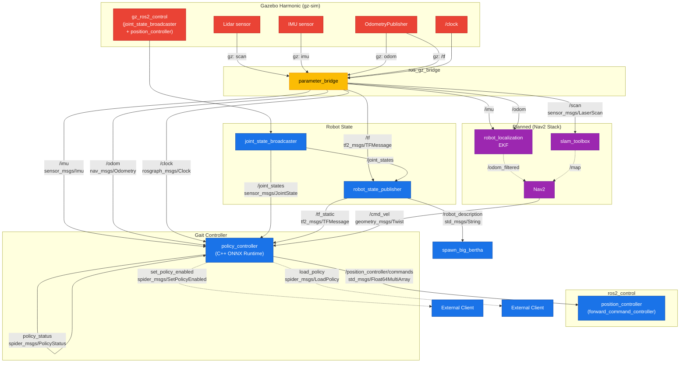

# ROS 2 Graph — Spider Bot Bringup

## Nodes

| Node | Package | Publisher Topics | Subscriber Topics |
|---|---|---|---|
| **policy_controller** | `big_bertha_policy_controller` | `/position_controller/commands` (Float64MultiArray), `policy_status` (PolicyStatus) | `/odom`, `/imu`, `/joint_states`, `/cmd_vel` |
| **robot_state_publisher** | `robot_state_publisher` | `/tf_static`, `/robot_description` | `/joint_states` |
| **joint_state_broadcaster** | ros2_control | `/joint_states` (sensor_msgs/JointState) | — |
| **position_controller** | ros2_control | — | `/position_controller/commands` |
| **ros_gz_bridge** | `ros_gz_bridge` | `/scan`, `/imu`, `/odom`, `/tf`, `/clock` | (gz→ros) |
| **spawn_big_bertha** | `ros_gz_sim` | — | `/robot_description` |

## Custom Interfaces

**Messages:**
- `spider_msgs/msg/PolicyStatus` — header, rate_hz, inference_ms, action_norm, enabled
- `spider_msgs/msg/GaitCommand` — vx, vy, yaw_rate

**Services:**
- `spider_msgs/srv/SetPolicyEnabled` — `bool enabled` → `bool success, string message`
- `spider_msgs/srv/LoadPolicy` — `string model_path` → `bool success, string message`
