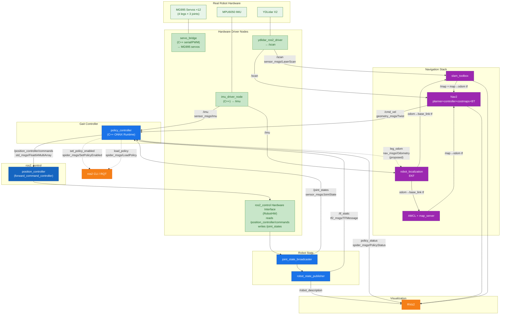

# ROS 2 Graph — Real Robot (Proposed)

## Nodes

| Node | Package | Publisher Topics | Subscriber Topics |
|---|---|---|---|
| **policy_controller** | `big_bertha_policy_controller` | `/position_controller/commands` (Float64MultiArray), `policy_status` (PolicyStatus), `leg_odom` (Odometry, proposed) | `/odom`, `/imu`, `/joint_states`, `/cmd_vel` |
| **robot_state_publisher** | `robot_state_publisher` | `/tf_static`, `/robot_description` | `/joint_states` |
| **joint_state_broadcaster** | ros2_control | `/joint_states` (sensor_msgs/JointState) | — |
| **position_controller** | ros2_control | — | `/position_controller/commands` |
| **servo_bridge** | `big_bertha_bringup` (TODO) | — | internal: position targets → serial/PWM |
| **imu_driver_node** | `big_bertha_bringup` (TODO) | `/imu` (sensor_msgs/Imu) | — |
| **ydlidar_ros2_driver** | `ydlidar_ros2_driver` | `/scan` (sensor_msgs/LaserScan) | — |
| **robot_localization** | `robot_localization` | filtered odometry + tf | `/imu`, `/odom` |

## Sim → Real Changes

| Sim | Real Robot |
|---|---|
| Gazebo Harmonic (physics engine) | Physical MG995 servos + sensors |
| `ros_gz_bridge` | `ydlidar_ros2_driver`, `imu_driver_node`, `servo_bridge` |
| `gz_ros2_control` (Gazebo plugin) | Custom `RobotHW` ros2_control interface → serial/PWM |
| `/odom` from Gazebo OdometryPublisher | Leg odometry from joint states → EKF (`leg_odom` proposed) |
| `use_sim_time:=true` | `use_sim_time:=false` |

## Hardware BOM (from PLAN.md §11)

- **Compute:** Arduino UNO Q (4 GB, arm64) — ROS 2 Jazzy
- **Actuators:** 12× MG995 servos (4 legs × 3 joints)
- **Lidar:** 1× YDLidar X2
- **IMU:** 1× MPU6050
